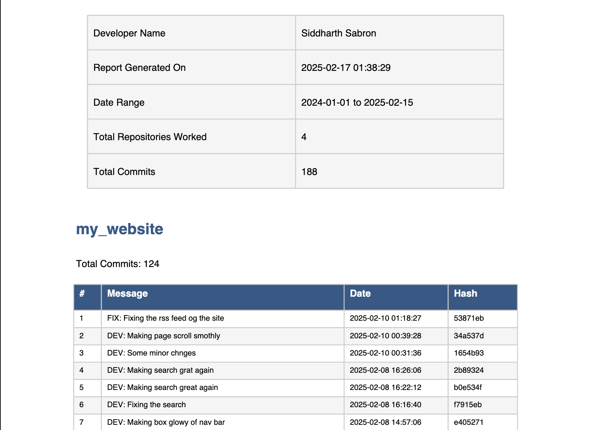

# A Simple Github Report Generator

A lot of time we developer do not log or maintain any report of what all code i have done in what all projects/repositories
and we keep procastinating about to make report for this and we always fail 

Here is i have made a simple python script which will gneerate a report of your hardwork

## 🎥 Demo



Check out a sample generated report: [View Sample Report](report.pdf)

## 📋 What You'll Get

- **report.pdf**: A professionally formatted PDF with:
  - Developer details
  - Commit summaries
  - Repository statistics
  - Detailed commit logs
  - Color-coded tables

- **report.txt**: A plain text version of the same report

## 🔧 Requirements

- Python 3.x
- Git installed
- SSH access to your repositories
- Required Python packages:
  ```
  GitPython
  reportlab
  Pillow
  ```

## 🎨 Customization

Want different colors or formatting? Edit the PDF styles in `generate_pdf()`:
```python
styles.add(ParagraphStyle(
    name='CustomTitle',
    parent=styles['Heading1'],
    fontSize=24,
    textColor=colors.HexColor('#2E5A88')
))
```

```curl
python script.py \
  --developer-name "Siddharth Sabron" \
  --author "siddharth1729" \
  --start-date 2022-01-01 \
  --end-date 2026-06-08
```

## 🚨 Troubleshooting

1. **SSH Issues**
   - Verify SSH key setup with GitHub
   - Check repository permissions

2. **PDF Generation Fails**
   - Ensure all dependencies are installed
   - Check write permissions in folder

## 📝 Example Output

```
==================================================
Developer Name           : John Doe
Report Generated On     : 2024-02-17 01:38:29
Date Range             : 2024-01-01 to 2025-02-15
Total Repositories     : 4
Total Commits          : 188
==================================================
```

## 🤝 Contributing

Found a bug? Have an improvement? Pull requests are welcome!

## 📄 License

MIT License - feel free to use and modify!

---

⭐ Star this repo if you found it helpful! and suggest any new feature in issues if you like

